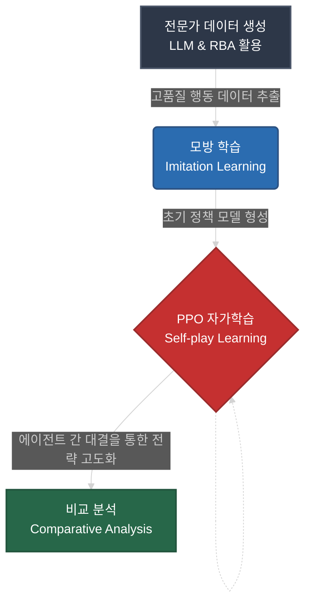

<div align="center">
  
# Mafia AI: RL 및 IL 기반 전략 분석 연구 프로젝트

본 프로젝트는 한동대학교 컴퓨터 연구 동아리 **CRA (Computer Research Association) 25-2기 시민팀**이 진행한 연구 프로젝트입니다. 
마피아 게임이라는 복잡한 사회적 상호작용 환경에서 **강화학습(RL)**과 **모방 학습(IL)** 기법의 효용성을 실험하고, 
에이전트의 수렴 속도 및 창발적 전략(Emergent Strategy) 형성을 분석하는 연구 플랫폼을 지향합니다.

</div>

---

## 1. 연구 워크플로우 (Research Workflow)

본 시뮬레이터는 최적의 학습 방법론을 도출하기 위해 다음과 같은 단계적 연구 프로세스를 수행합니다:



1. **전문가 데이터 생성 (Expert Data Generation)**: `LLM(Solar-Pro)` 및 `RBA`를 활용하여 고품질의 전문가 행동 데이터를 추출하고 기록합니다.
2. **모방 학습 진행 (Imitation Learning)**: 수집된 데이터를 바탕으로 `RL` 에이전트의 초기 정책 모델을 사전 학습하여 기초 전략을 형성합니다.
3. **PPO 자가학습 (Self-play Learning)**: `IL`을 통해 초기화된 에이전트들이 `PPO` 알고리즘을 통해 서로 대결하며 고도화된 전략을 스스로 학습합니다.
4. **비교 분석 (Comparative Analysis)**: 여러 `IL` 및 자가학습 기법을 비교하여 수렴 속도와 창발적 전략(Emergent Strategy)의 유효성을 정량적으로 분석합니다.

---

## 2. 기술 스택 (Tech Stack)

| 분류 | 기술 항목 |
| :---: | :--- |
| **AI & RL** | `PyTorch`, `Gymnasium`, `PettingZoo`, `SuperSuit`, `PPO`, `REINFORCE` |
| **Models** | `LSTM`, `GRU`, `Deep MLP (Dynamic Actor-Critic)` |
| **LLM** | `OpenAI API (Solar-pro)`, `Upstage API` |
| **Engine** | `Python (Pydantic)`, `YAML` |
| **GUI & Ops** | `PyQt6`, `TensorBoard`, `Python-dotenv` |

---

## 3. 핵심 시스템 사양

### 관측 및 액션 공간 (Space Dimensions)

* **Observation Space ($286$차원)**: 플레이어 생존 상태, 자기 역할, 누적 투표 기록 매트릭스, 공격/조사 지도, 변호 매트릭스 등을 포함한 정밀한 관측 벡터를 제공합니다.
* **Action Space (Multi-Discrete $[9, 5]$)**: 대상 지목($Target$) $9$차원(0~7번 및 PASS)과 역할 주장($Role$) $5$차원(None 및 4개 역할)을 동시에 처리합니다.

### 학습 설정 (Hyperparameters)

* **Learning Rate**: $0.0001$
* **Gamma**: $0.99$
* **Batch Size**: $256$
* **IL Coefficient**: $0.1$

---

## 4. 팀원 정보 (Contributors)

본 프로젝트는 **한동대학교 CRA 25-2 시민팀**에 의해 개발되었습니다.

| 이름 | 역할 | 담당 업무 | GitHub |
| :---: | :---: | :--- | :---: |
| **Taeju Park** | `Project Manager` | $AI$ 알고리즘($PPO$, $REINFORCE$) 및 모델 구현, 시스템 통합 | [@xoxown31](https://github.com/xoxown31) |
| **Changkwon Kim** | `Software Engineer` | $GUI$ 시뮬레이터(런처/뷰어) 개발 및 $TensorBoard$ 시각화 연동 | [@chang1025](https://github.com/chang1025) |
| **Jinwon Hong** | `AI Researcher` | $LLM$ 에이전트 설계 및 게임 엔진/환경 로직 개발 | [@11Won11](https://github.com/11Won11) |

---

## 5. 실행 가이드

### 환경 설치

```bash
pip install -r requirements.txt
```

### 시뮬레이터 실행 (GUI)

```bash
python main.py
```

> [!TIP]
> 런처 인터페이스를 통해 **학습 모드($Train$)**와 **테스트 모드($Test$)**를 선택하고, 각 에이전트의 신경망 구조($Backbone$)와 역할을 개별적으로 설정할 수 있습니다.

---

## 6. 디렉토리 구조 (Directory Structure)

디렉토리별 상세한 내용은 각 폴더의 `README.md`를 참고하세요.

[**`ai/`**](ai/README.md) : 강화학습 모델, 구조, 버퍼 설정 로직
[**`core/`**](core/README.md) : 마피아 게임 핵심 엔진 요소 및 RL 래퍼
[**`gui/`**](gui/README.md) : 시뮬레이터 실행용 화면 및 텐서보드 통합 뷰어
[**`apps/`**](apps/README.md) : 인간 프롬프트 및 상호작용 관련 스크립트 모음
[**`command/`**](command/README.md) : 터미널 기반 커스텀 실행, 최적화 모듈