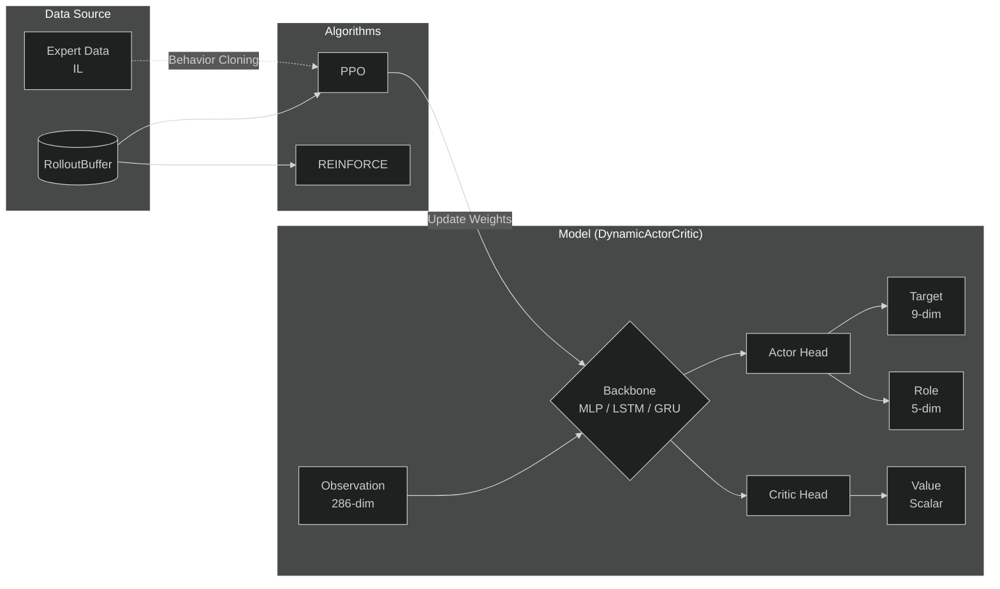

# AI Modules (강화학습 및 모델)

  강화학습(RL)을 위한 신경망 모델, 학습 알고리즘(PPO, REINFORCE), 그리고 데이터 버퍼를 포함하는 코어 기반 모듈입니다.

---

## 아키텍처 다이어그램 (Architecture)

**DynamicActorCritic** 네트워크와 **학습 프로세스**의 전반적인 데이터 흐름입니다.

---

## 파일 구성 (File Structure)

### 1️. `model.py` : `DynamicActorCritic`
* **역할**: Actor-Critic 구조의 신경망 정의.
* **특징**:
  * `backbone` 옵션에 따라 **MLP**, **LSTM**, **GRU** 중 모델을 유연하게 선택 가능.
  * **Multi-Discrete Action Head**: 타겟 선정($9$차원)과 직업 주장($5$차원)을 위해 두 개의 독립적인 Actor 출력 헤드를 가집니다.
  * RNN 층(LSTM/GRU) 사용 시 내부 **Hidden State를 자동으로 관리**하며 시퀀스 배치 처리를 지원합니다.

### 2️. `ppo.py` : `Proximal Policy Optimization`
* **역할**: PPO(근사 정책 최적화) 알고리즘 구현체.
* **주요 기능**:
  * `RolloutBuffer`에 저장된 게임 경험(Transitions)을 바탕으로 정책 업데이트 진행.
  * **Imitation Learning (IL)**: 전문가 데이터(`expert_loader`)가 제공될 경우, 기존 PPO Loss에 **BC(Behavior Cloning) Loss**를 결합하여 학습을 가속화합니다.
  * GAE(Generalized Advantage Estimation) 방식 적용 및 Critic/Actor Gradient Clipping으로 학습 안정성 확보.

### 3️. `reinforce.py` : `REINFORCE`
* **역할**: 기본적인 Policy Gradient 알고리즘 구현체.
* **주요 기능**:
  * Monte-Carlo 방식으로 에피소드 종료 후 실제 누적 리턴(Return)을 계산하여 학습.
  * PPO 최적화 알고리즘과의 수렴 성능 및 안정성 비교를 위한 **베이스라인(Baseline)** 모델로 활용됩니다.

### 4. `buffer.py` : `RolloutBuffer`
* **역할**: PPO 및 REINFORCE 에이전트의 오프폴리시(Off-policy) 학습을 위한 임시 저장소.
* **저장 항목**: 에피소드 진행 간 발생하는 다양한 트랜지션 데이터 (`State`, `Action`, `Reward`, `LogProb`, `Value` 등)

---

⬅️ **[메인으로 돌아가기](../README.md)**