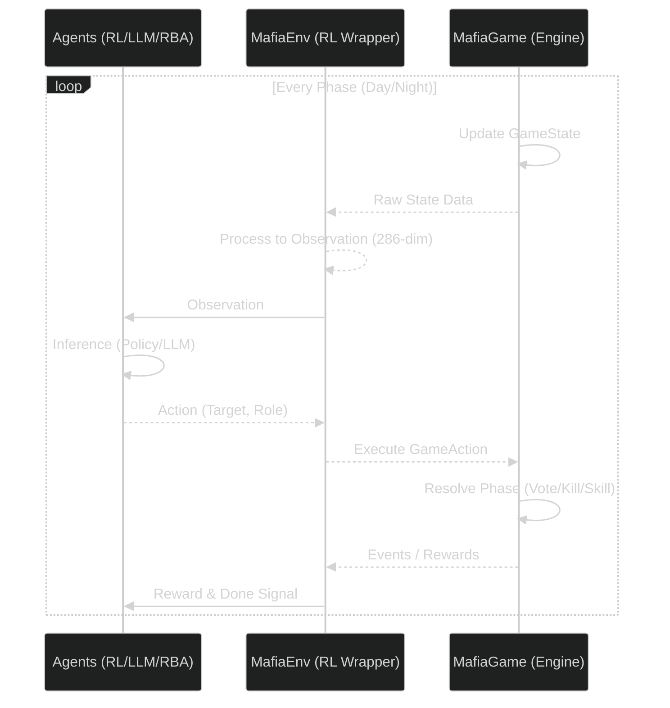

# Core Modules (게임 엔진 및 RL 래퍼)

  마피아 게임 AI 프로젝트의 핵심 로직이 구현된 디렉토리입니다.  
  게임 엔진, 에이전트 설계, 강화학습 환경 래퍼, 그리고 실험 관리자를 포함하고 있습니다.

---

## 아키텍처 및 상호작용 (Architecture & Interaction)

`Agent`, `Environment(RL Wrapper)`, `Game Engine` 간의 상호작용 구조입니다.

---

## 디렉토리 구조 및 설명 (Directory Structure)

### 1. `agents/` (AI 에이전트)

다양한 전략과 알고리즘을 사용하는 플레이어 에이전트들의 구현체입니다.

* **`base_agent.py`**: 모든 에이전트가 상속받는 추상 기본 클래스(ABC). 공통 인터페이스 `get_action(status)`을 정의.
* **`rl_agent.py`**: 강화학습(RL) 기반 에이전트. PPO 및 REINFORCE 알고리즘 지원. (`DynamicActorCritic` 모델 사용)
* **`llm_agent.py`**: 거대 언어 모델(`LLM`, Solar-pro 등)을 활용한 생성형 에이전트. 프롬프트 기반 자연어 로직 추론.
* **`rule_base_agent.py`**: 사전 정의된 휴리스틱(Heuristics)에 따라 행동하는 에이전트. (경찰, 의사, 마피아 정석 플레이)

### 2. `engine/` (순수 게임 엔진)

강화학습 라이브러리에 독립적인 로컬 마피아 게임 시스템입니다.

* **`game.py` (`MafiaGame`)**: 환경 페이즈(낮/밤), 투표, 처형, 특수 능력 등 코어 로직 담당.
* **`state.py`**: 
  * `GameStatus`: 생존자 목록, 턴 상태 등 에이전트용 관측 데이터(DTO).
  * `GameAction`: 플레이어의 행위 선언 (`Target`, `Role`).
  * `GameEvent`: 게임 진행 중 발생한 이벤트의 로그.

### 3. `envs/` (강화학습 환경 래퍼)

순수 엔진을 RL 학습 규격에 맞게 변환(`PettingZoo ParallelEnv`)한 모듈입니다.

* **`mafia_env.py` (`MafiaEnv`)**
  * **Observation Space** (`286-dim`): 플레이어 상태, 진행도, 투표/공격/조사 맵의 Feature Vector화.
  * **Action Space** (`Multi-Discrete [9, 5]`):
    | 차원 구분 | 공간 크기 | 설명 |
    | :---: | :---: | :--- |
    | Target | 9 | `0~7번` 플레이어 + `PASS` |
    | Role | 5 | `경찰`, `의사`, `마피아`, `시민`, `None` |
  * **Reward System**: 생존/승패 보상뿐만 아니라 마피아 처형 기여, 직업 활약에 따른 밀집(Dense) 보상 제공.

### 4. `managers/` (실험 및 게임 관리)

실행 파이프라인, 로깅, 성능 분석용 유틸리티 클래스입니다.

* **`experiment.py` (`ExperimentManager`)**: 실험 설정값(`config`) 기반 에이전트 생성 및 병렬 훈련 셋업.
* **`runner.py`**:
  * `train()` : 병렬 환경을 활용한 대규모 RL 에이전트 Self-play 학습.
  * `test()` : 단일 환경 시뮬레이션(에피소드) 구동 및 평가.
* **`logger.py` (`LogManager`)**: 이벤트의 JSONL 기록 및 **TensorBoard** 메트릭 동기화.
* **`stats.py` (`StatsManager`)**: 승률, 직업 활약도 등 상세 통계 지표 추출.
* **`expert.py` (`ExpertDataManager`)**: `IL` 사전 학습용 전문가 궤적 수집 및 데이터셋화.

---

**[메인으로 돌아가기](../README.md)**